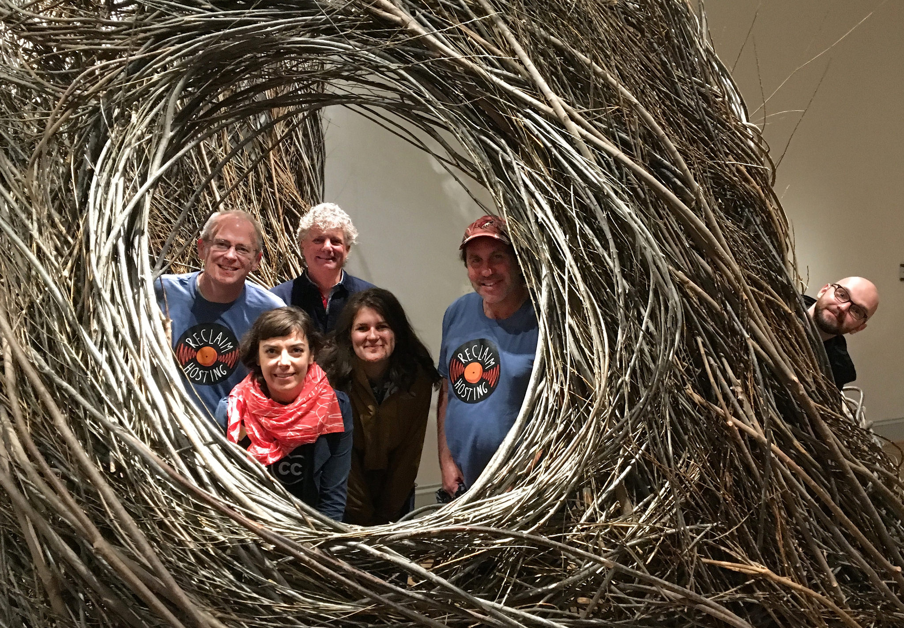

# Contents for CC Certification Draft 2.0

Making this because editing the spreadsheet is a bear-- converted the spreadsheet content to Markdown.

Fork this repo! and make derivatives for versions based on meeting feedback. Will be easier to work on this if you are added as a collaborator -- [submit an issue](https://github.com/cogdog/cc-cert-draft/issues). Then you can make direct edits here rather than forking. But if you like forking, go for it. 

## Contents
*[Version 1.1](./v1.1.md) (retired)
*[Version 2.0](./v2.0.md) (current master version, either fork this file, rename, and submit pull, or make a new full using contents as base) 
**[Government Version](./v2.0-gov.md) by Alan from May 13 Washington DC meeting
**[Education Version](./v2.0-edu.md) by Kamil from May 13 Washington DC meeting
